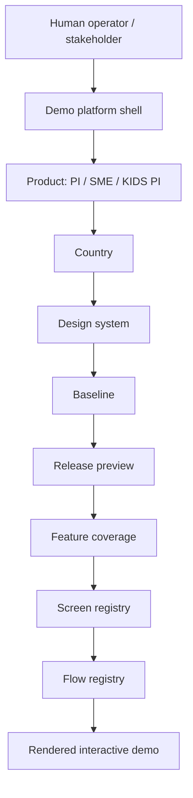
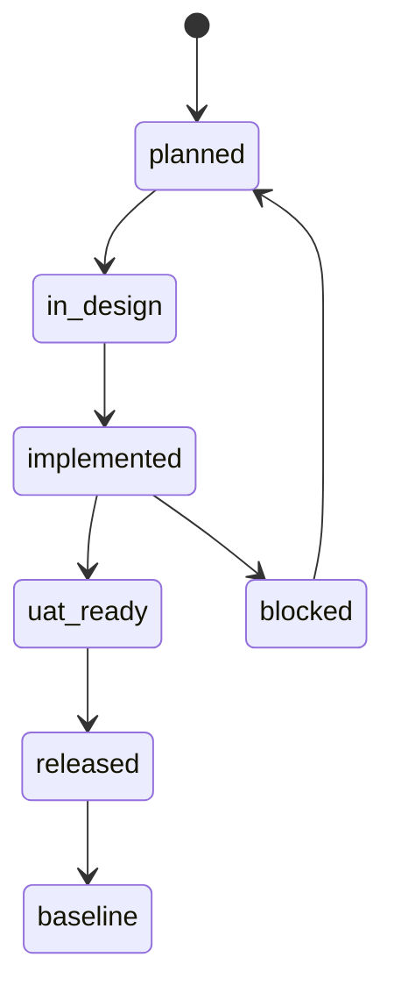

# Mobile Banking CEE Project Model

Last updated: 2026-06-04

This document is the architecture contract for how the demo platform should organize PI, SME, countries, design systems, baselines, releases, features, screens, and flows.

It exists so humans can speak naturally and AI contributors can work with stable project concepts instead of guessing from component names.

## Purpose

The project must serve three related uses:

1. Standalone stakeholder demo platform.
2. Reusable source of screens and components for future AI-assisted flow construction.
3. Extractable module for a larger platform that hosts multiple application demos.

## Core Model



## Official Terms

### Product

`product` identifies the application family.

Current target values:

- `PI`: personal individual mobile banking;
- `SME`: small and medium enterprise mobile banking;
- `KIDS_PI`: kids-focused PI application layer, surfaced in runtime as Mobile PI Kids.

Current runtime note: `KIDS_PI` has active current-design-system Kids concepts for Slovakia, Hungary, and the newer Romania Teens implementation. Both Serbia Kids experiments are retired; RS, CZ, BA, BA_BL, SI, and future-design-system Kids contexts render the honest planned-state placeholder until a new approved concept is implemented. Slovakia is currently rebuilt from the Bulbank Teen/Kids document direction with Products, Education, Tasks, and More pages.

Rule: product differences must be explicit. Do not hide PI/SME divergence inside generic component conditionals without metadata.

### Country

`country` identifies the market context.

Current values:

- `RO`
- `CZ`
- `SK`
- `HU`
- `RS`
- `BA`
- `BA_BL`
- `SI`

Country affects copy, currency, capability availability, legal terminology, and sometimes screen composition.

### Design System

`designSystem` identifies the visual/component system.

Current target values:

- `current`: current UniCredit CEE light restyle system;
- `next`: future design system deviation.

Rule: a design-system change is not the same thing as a release feature. It can affect the same screens, but it must remain separately selectable and documented.

### Baseline

`baseline` is the official stable state used for UAT/stakeholder reference.

Baseline answers:

```text
What should the app look like if no future release preview is enabled?
```

Rule: a feature becomes baseline only through explicit promotion.

### Release

`release` is a project-evolution bundle that can contain one or more features before they become baseline.

Release answers:

```text
What are we previewing beyond the current baseline?
```

Current runtime note: the app uses explicit `release` and `baseline` state. There is no release-like `variant` field in the demo store.

### Feature

`feature` is a user-visible capability, visual change, or controlled behavior.

Each feature should define:

- id;
- label;
- description;
- lifecycle status;
- product scope;
- country scope;
- design-system scope;
- introduced release;
- baseline promotion target;
- affected screens;
- coverage status.

### Screen

`screen` is an addressable view in the mobile demo.

A screen should define:

- id;
- current runtime screen key;
- product scope;
- country scope;
- design-system scope;
- status;
- layout family;
- owned component path;
- related screenshots;
- known features;
- similar screens.

### Flow

`flow` is an ordered journey through screens.

A flow should define:

- id;
- product scope;
- country scope;
- entry screen;
- ordered screen steps;
- required features;
- optional features;
- status;
- evidence.

## Layering

Recommended folder model:

```text
src/
  app/
    platform/          # future shared shell/control-panel logic
    registry/          # product/country/release/screen/flow metadata
    state/             # runtime state and resolvers
    components/        # shared demo components
    screens/           # active rendered screens
  translations/        # per-country language packs
  data/                # static demo data
  imports/             # generated Figma imports and assets
docs/
  architecture/        # project model and integration contracts
  handoff/             # AI Contributor OS session state
  platform-capability-map/
```

Future product split can introduce:

```text
src/products/pi/
src/products/sme/
```

Do not move runtime files into that structure until there is a focused refactor step and verification.

## Baseline And Release Lifecycle



Lifecycle definitions:

| Status | Meaning |
| --- | --- |
| `planned` | Agreed concept, not implemented. |
| `in_design` | Design/source material exists or is being mapped. |
| `implemented` | Runtime exists, not necessarily UAT-ready. |
| `uat_ready` | Ready for stakeholder/UAT review. |
| `released` | Included in a release preview or delivered release. |
| `baseline` | Official stable behavior. |
| `blocked` | Cannot progress without decision, asset, or dependency. |

## Control Panel Direction

The current settings/features panel should evolve into a control panel.

It now exposes the Phase 1 reference-platform controls and should continue to evolve carefully:

- product: `PI` / `SME` / `KIDS_PI`;
- country;
- design system;
- baseline;
- release preview;
- scenario;
- banking scenario;
- holdings;
- entitlements;
- limits;
- disabled-action reasons;
- project-pack readiness;
- language;
- active features;
- missing/partial coverage;
- known limitations for the selected context.

The control panel must not imply that unimplemented functionality exists. Partial and missing states should be visible.

## AI Catalog Direction

The project should maintain a registry that helps AI answer:

- Which screen should I use for this requested flow?
- Which existing screen does a screenshot resemble?
- Which components are safe to reuse?
- Which countries/products/design systems are covered?
- Which features are baseline vs release preview?

AI catalog entries should favor structured metadata over prose-only docs.

Minimum useful fields:

```ts
{
  id: "pi.home.overview",
  product: "PI",
  countries: ["RO", "CZ", "SK", "HU", "RS", "BA", "BA_BL", "SI"],
  designSystems: ["current"],
  layoutFamily: "dashboard",
  status: "implemented",
  componentPath: "src/app/screens/home/HomeScreen.tsx",
  features: ["fx_cardsRedesign", "fx_unplannedBanner"],
  screenshots: ["screenshots/homepage.png"],
  similarTo: []
}
```

## Larger Platform Integration Contract

The standalone demo should eventually be embeddable as:

```tsx
<MobileBankingDemo
  product="PI"
  country="RO"
  designSystem="current"
  baseline="uat-current"
  releasePreview={["release-v1"]}
  initialScreen="pi.home.overview"
/>
```

This is a target contract, not current runtime behavior.

## Current Implementation Status

| Area | Status | Evidence |
| --- | --- | --- |
| Country switching | implemented | `src/app/components/demo/DemoTopBar.tsx`, `src/app/registry/demoConfig.ts` |
| Scenario switching | implemented | `src/app/state/demoTypes.ts`, `src/app/state/demoStore.tsx` |
| Release/baseline switching | implemented | `src/app/registry/releaseRegistry.ts`, `src/app/state/demoStore.tsx`, `src/app/components/demo/DemoTopBar.tsx` |
| Baseline ledger and release promotion readiness | implemented as Phase 1 infrastructure | `src/app/registry/baselineRegistry.ts`, `src/app/registry/releaseRegistry.ts`, `src/app/registry/featureManifestRegistry.ts` |
| Feature metadata | implemented as manifest foundation, runtime coverage still varies by screen | `src/app/registry/demoConfig.ts`, `src/app/registry/featureManifestRegistry.ts`, `src/app/registry/featureUI.ts` |
| Banking scenario and entitlements model | implemented as mock-driven control-plane infrastructure | `src/app/platform/banking/bankingScenarioRegistry.ts`, `src/app/platform/effectiveAppContext.ts`, `src/app/components/demo/DemoFeatureSidePanel.tsx` |
| Contract-ready mock repositories | implemented as adapter-ready mock repositories | `src/app/platform/data/bankingRepositories.ts` |
| Project packs | implemented for all 24 product/country combinations | `src/app/registry/projectPackRegistry.ts` |
| PI/SME/KIDS_PI product model | implemented as runtime selector; SME and unsupported Kids contexts use planned-state placeholders, while SK/HU current DS Mobile PI Kids contexts render homepage/navigation concept variants, with SK currently rebuilt from the Bulbank Teen/Kids document direction | `src/app/registry/projectModel.ts`, `src/app/components/demo/DemoTopBar.tsx`, `src/app/App.tsx`, `src/app/components/UnsupportedContextScreen.tsx`, `src/app/screens/kids/KidsMarketHomeApp.tsx`, `src/data/kidsMarketHomeConcepts.ts` |
| Screen registry | foundation only | `src/app/registry/screenRegistry.ts` |
| Flow registry | foundation plus SK/HU Kids homepage bottom-nav comparison flow | `src/app/registry/flowRegistry.ts` |
| Component registry | foundation plus SK/HU Kids homepage component entry | `src/app/registry/componentRegistry.ts` |
| AI catalog export | foundation only | `src/app/registry/aiCatalog.ts` |
| Next design system | implemented as runtime selector with planned-state placeholder | `src/app/registry/projectModel.ts`, `src/app/components/demo/DemoFeatureSidePanel.tsx`, `src/app/components/UnsupportedContextScreen.tsx` |
| Larger platform export | foundation only | `src/app/registry/aiCatalog.ts` |

## Rules For Future Contributors

1. Prefer adding metadata before adding hidden branching.
2. If a feature affects a screen, record it in feature metadata and screen registry.
3. If a screen is only partial, call it partial.
4. If a release is promoted to baseline, update release metadata and handoff docs.
5. If product behavior changes, update the platform capability map.
6. If a future session might be confused, create or triage a banana.
